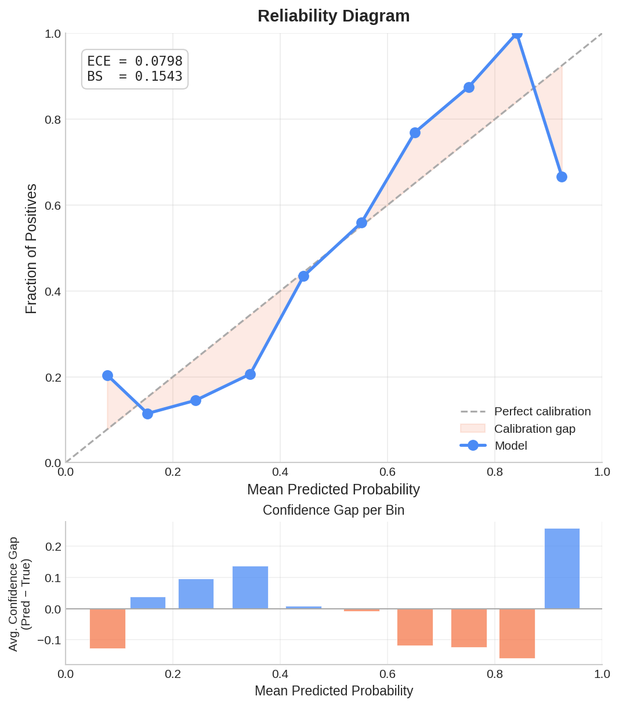
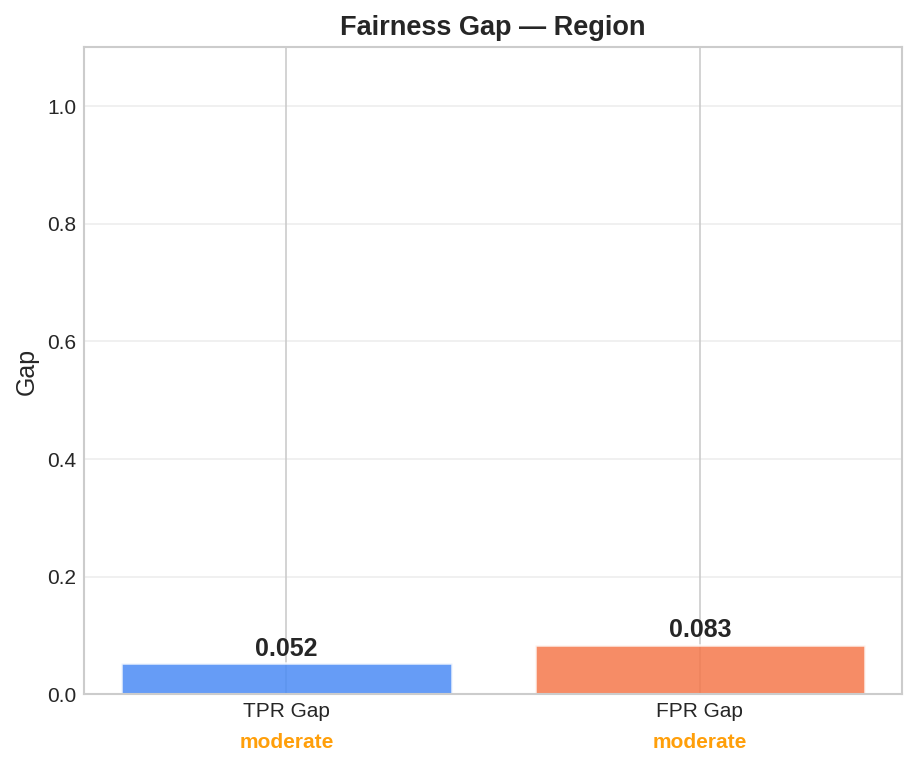
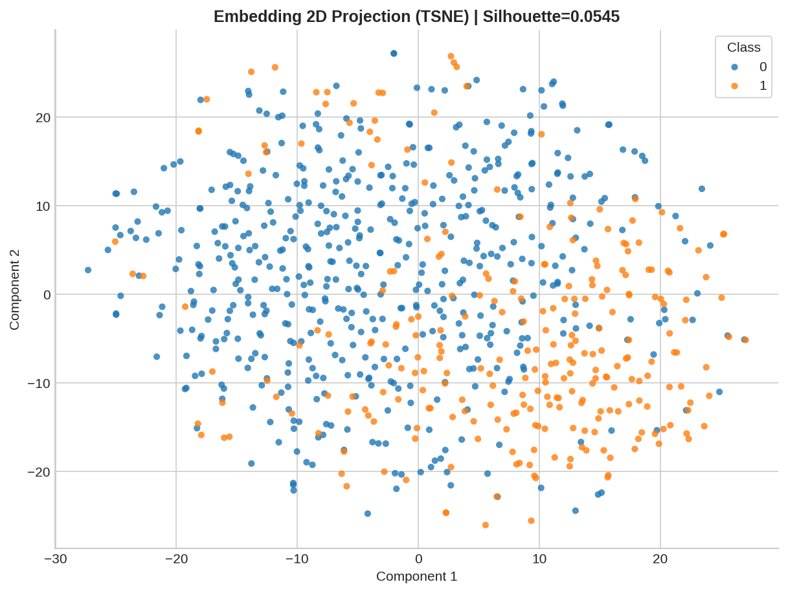
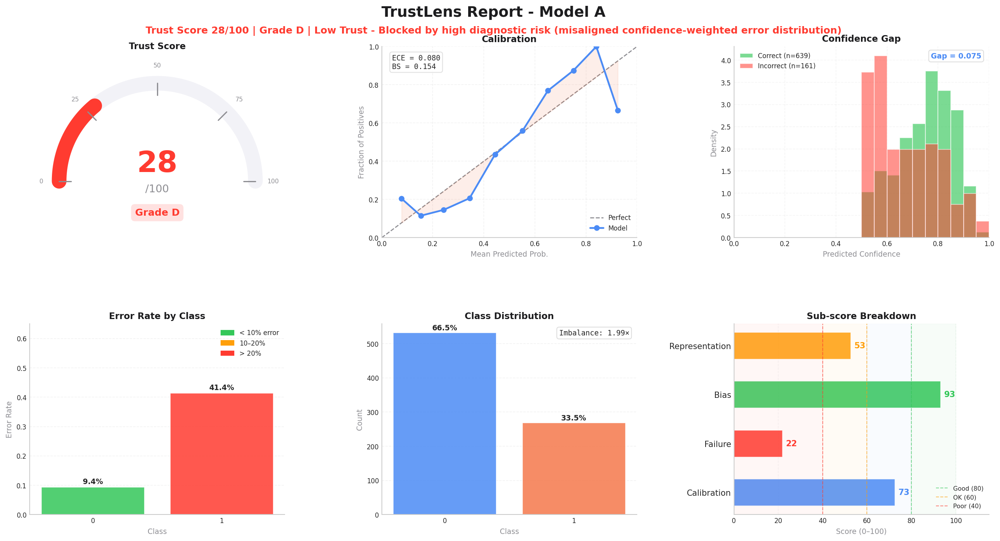

<div align="center">


<br/>

# TrustLens

### Audit ML models beyond accuracy — calibration, fairness, latent health, and deployment verdicts.

<br/>

[](https://pypi.org/project/trustlens/)
[](https://pypi.org/project/trustlens)
[](https://github.com/Khanz9664/TrustLens/actions)
[](https://github.com/Khanz9664/TrustLens)
[](LICENSE)
[](https://github.com/Khanz9664/TrustLens/actions)

<br/>

[**Quickstart**](#quickstart) · [**How It Works**](#how-it-works) · [**Demo Video**](https://youtu.be/lZo7aWg6efI) · [**Docs**](docs/index.md) · [**Project Showcase**](https://khanz9664.github.io/portfolio/projects/trustlens.html)

</div>

---

> **Your model has 92% accuracy. It's still not safe for deployment.**
>
> Accuracy measures what went right. TrustLens measures what can go wrong — in production, on subgroups, and at high confidence.

---

## Why TrustLens

Standard evaluation stops at accuracy. Silent failures happen when:

- A model is **overconfident** — "90% sure" but right only 60% of the time
- Performance **collapses on subgroups** — gender, age, or region hidden inside a good aggregate score
- The model is **confidently wrong** — high-confidence errors that indicate systemic risk
- **Latent representations overlap** — classes bleed together where the model can't tell them apart

TrustLens surfaces all four with a single audit, and outputs a machine-readable deployment verdict.

---

## Supported Frameworks

TrustLens uses a **Prediction Resolver Architecture** to automatically handle different ML frameworks:

- **scikit-learn** — Full support for all `ClassifierMixin` estimators.
- **XGBoost** — Native support for `XGBClassifier` and raw `Booster` objects.
- **Planned** — LightGBM, CatBoost, PyTorch, TensorFlow/Keras.

TrustLens **automatically detects** your model's framework. You don't need to change your code when switching from sklearn to XGBoost.

---

## Quickstart

```bash
pip install trustlens
# Extended visualization support
pip install trustlens[full]
```

Run a one-line audit to see why 94% accuracy isn't the full story:

```python
from trustlens import quick_analyze

quick_analyze(dataset="breast_cancer")
```

```
TRUST SCORE: 68/100 [D]
Assessment : Low Trust — Blocked by high diagnostic risk

  Base Score        : 76
  Penalties Applied : -7.7 (Failure Risk)
  Final Score       : 68

→ Model shows high failure risk and is NOT ready for deployment.
```

---

## How It Works

TrustLens runs four diagnostic modules and combines them into a single **Trust Score (0–100)** with a CI/CD-ready deployment verdict.

| Module | What It Catches |
|---|---|
|  **Calibration** | Confidence vs. correctness mismatch, overconfidence, ECE |
|  **Fairness** | Subgroup performance gaps, equalized-odds violations |
|  **Representation** | Latent space health, class separation, overlap detection |
|  **Decision Engine** | Composite Trust Score + `Ready` / `Blocked` verdict |

---

## Full Audit

### Automatic Detection (Sklearn / XGBoost)

```python
from trustlens import analyze
from xgboost import XGBClassifier

model = XGBClassifier().fit(X_train, y_train)

# TrustLens automatically detects XGBoost and resolves predictions
report = analyze(
    model=model,
    X=X_test,
    y_true=y_test,
    sensitive_features={"gender": gender_test}
)

report.show()
```

### Manual Prediction Override

For external inference systems or unsupported frameworks, you can pass predictions directly:

```python
report = analyze(
    model=None, # optional when passing y_pred/y_prob
    X=X_test,
    y_true=y_test,
    y_pred=external_preds,
    y_prob=external_probs
)
```

### Audit Metadata & Provenance

Every report tracks its own backend provenance for auditability:

```python
print(report.metadata["framework"])  # "xgboost"
print(report.metadata["backend"])    # {'resolver': 'xgboost', 'framework_version': '2.0.3', ...}
```

### Save & Export

```python
# Save as a unified JSON artifact (best for experiment trackers)
report.save("report.json")

# Save as a full directory bundle (best for human review)
report.save("trust_report/")
```

### Output artifacts (Directory Bundle)

```
trust_report/
├── trust_score.json    ← deployment verdict & composite score
├── report.json         ← raw diagnostic metrics
├── metadata.json       ← environment, version, backend provenance
├── report.txt          ← human-readable summary
└── visuals/            ← per-module diagnostic plots (PNG)
```

### CI/CD gating

Gate model promotion on `trust_score.json` — no custom scripting needed:

```json
{
  "score": 68,
  "grade": "D",
  "verdict": "Low Trust — Blocked by high failure risk",
  "is_blocked": true
}
```

---

## Diagnostics in Practice

<div align="center">
<table width="100%">
  <tr>
    <td width="50%" align="center">
      <b>Calibration</b><br/>
      <br/>
      <sub>Does confidence align with correctness?</sub>
    </td>
    <td width="50%" align="center">
      <b>Fairness & Bias</b><br/>
      <br/>
      <sub>Are subgroups treated equally?</sub>
    </td>
  </tr>
  <tr>
    <td width="50%" align="center">
      <b>Latent Space Health</b><br/>
      <br/>
      <sub>Is class separation clean?</sub>
    </td>
    <td width="50%" align="center">
      <b>Deployment Verdict</b><br/>
      <br/>
      <sub>Is this model safe to ship?</sub>
    </td>
  </tr>
</table>
</div>

---

## Demo

[](https://youtu.be/lZo7aWg6efI)

15-minute walkthrough: diagnostics, trust scoring, fairness analysis, and visual dashboards.

Want a deeper look at the architecture and design decisions? → [**Interactive Project Showcase**](https://khanz9664.github.io/portfolio/projects/trustlens.html)

---

## Run the Full Demo

```bash
python demo.py
```

Generates multi-model comparisons, fairness deep-dives, latent space projections, JSON audits, and visual dashboards across all modules.

---

## Contributing

All contributions welcome — new metrics, diagnostic plugins, and visualizations.

→ [**Contributing Guide**](CONTRIBUTING.md) · [**Open an Issue**](https://github.com/Khanz9664/TrustLens/issues) · [**Docs**](docs/index.md)

<br/>

<a href="https://github.com/Khanz9664"></a>
<a href="https://github.com/jayssSmm"></a>
<a href="https://github.com/WeiGuang-2099"></a>
<a href="https://github.com/CrepuscularIRIS"></a>
<a href="https://github.com/komoike-oss28-ui"></a>
<a href="https://github.com/sidharth-vijayan"></a>
<a href="https://github.com/MustansirNisar"></a>

---

## Citation

```bibtex
@software{trustlens2026,
  author = {Shahid Ul Islam},
  title  = {TrustLens: Audit ML models beyond accuracy},
  year   = {2026},
  url    = {https://github.com/Khanz9664/TrustLens}
}
```

<div align="center">
<br/>
Built by <a href="https://github.com/Khanz9664"><b>Shahid Ul Islam</b></a> &nbsp;·&nbsp;
<a href="https://khanz9664.github.io/portfolio/">Portfolio</a> &nbsp;·&nbsp;
<a href="https://www.linkedin.com/in/shahid-ul-islam-13650998/">LinkedIn</a>
</div>
