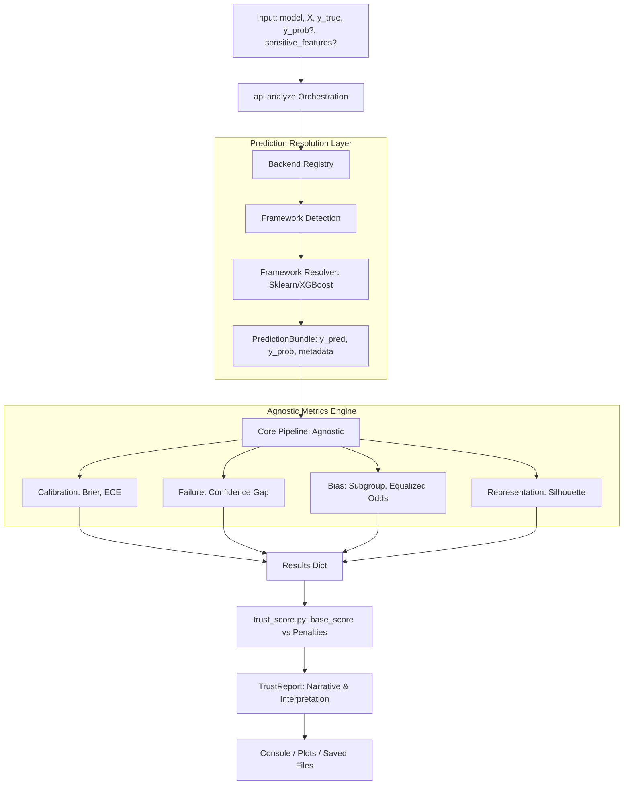
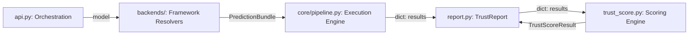
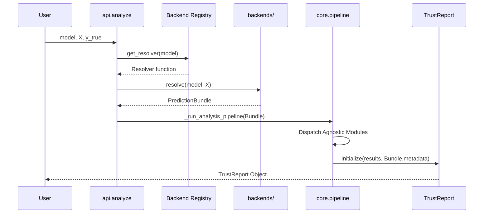

# System Architecture

TrustLens is designed as a layered pipeline so diagnostic computation, scoring logic, and report interpretation remain decoupled and maintainable.

## Why This Design Matters

The architecture aims to solve three practical needs:

- stable and testable metric computation
- explicit decision logic with traceable rules
- clear extension points for contributors

## High-Level Data Flow

This diagram shows how inputs move from orchestration through framework-specific resolvers to the agnostic metrics pipeline.

**Implementation note**: `analyze()` uses the `Backend Registry` to automatically detect the framework and resolve predictions into a standardized `PredictionBundle`. This ensures the core metrics pipeline remains 100% framework-agnostic.

## Component Interactions

The system is decoupled into four primary layers.

### Data Contracts

1. **API to Backends**: Model reference, feature matrix `X`, and optional manual overrides (`y_pred`, `y_prob`).
2. **Backends to Pipeline**: `PredictionBundle` containing standardized numpy arrays, framework identifier, and audit metadata.
3. **Pipeline to Metrics**: Normalized arrays (`y_true`, `y_pred`, `y_prob`) and optional metadata.
4. **Pipeline to Report**: Consolidated `results` plus audit provenance (framework version, resolver details).
5. **Report to Scorer**: Score computation from `results` including penalties and blockers.

## Execution Sequence

This sequence shows one `analyze()` call from input to `TrustReport`.

## Layer Responsibilities

### Orchestration Layer (`api.py`)

- Coordinates framework detection and prediction resolution.
- Validates high-level input shapes and data consistency.
- Delegates to the framework-agnostic core pipeline.

### Framework Resolvers (`backends/`)

- Handles framework-specific prediction logic (e.g., `predict_proba`).
- Normalizes output shapes (e.g., binary `(n,)` → `(n, 2)`).
- Captures audit metadata (framework version, model type).
- Blocks unsupported tasks (e.g., regression or ranking).

### Core Pipeline (`trustlens/core/pipeline.py`)

- **Framework-agnostic** execution engine.
- Dispatches enabled metrics modules.
- Manages progress tracking and resource isolation.

### Metrics Layer (`trustlens/metrics/`)

- Pure math/stat functions for diagnostics.
- Independent of models; operates entirely on labels and probabilities.

### Reporting Layer (`trustlens/report.py`)

- Packages diagnostic outputs with full backend provenance.
- Generates textual and visual summaries.
- Supports unified JSON serialization for experiment trackers.

### Comparison Layer (`comparison.py`)

- compares candidate `TrustReport` objects
- filters blocked candidates
- provides deployment recommendation rationale

## Extensibility Path

To add a new metric module:

1. implement the metric under `trustlens/metrics/`
2. wire dispatch logic in `analyze()`
3. ensure return format follows existing `results` conventions
4. add tests and documentation
5. optionally integrate into trust score weighting

## Architectural Constraints

- optimized for classification evaluation
- fairness checks are data- and task-dependent
- representation diagnostics require embeddings
- some threshold logic is currently heuristic by design

## Related Pages

- [Features and Modules](features.md)
- [Trust Score Explained](trust_score_explained.md)
- [Known Limitations](known_limitations.md)
- [Experimental Modules](EXPERIMENTAL.md)
